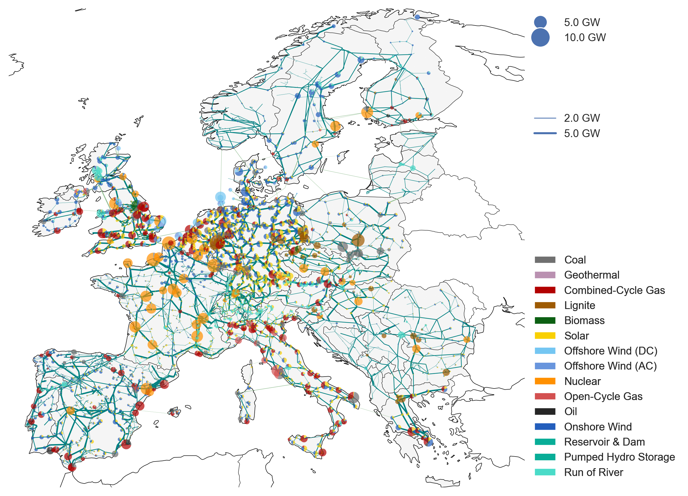

# Zoltán's Customisations
## End Goal
* Show how adding renewable generation in the right places in the network can reduce the need for network expansion
  * Compare optimisation outcome of generation-only expansion vs.
    transmission-only expansion, and everything in between

## Short-term tasks

## How Climate Data is Used
* `build_renewable_profiles` 

## Feasibility of runs
|                                      |                   |                         |
|--------------------------------------|-------------------|-------------------------|
| **`scenario.ll`**                    | `v1.01`           | `v1.1`                  |
| **renewables `expansion_limit`**     | `false`           | `1.0`                   |
| **Deleted `base.nc`?**               | Yes               | No                      |
| successful grid expansion iterations | 1                 | 3                       |
| final iteration outcome              | Numerical trouble | Infeasible or unbounded |
| num LP iterations in final iteration | 573               | 0                       |
| output file generated?               | No                | Yes                     |

## Findings
* Use `datashader` for dense data on a map
  ([example](https://medium.com/plotly/building-a-big-data-geographical-dashboard-with-open-source-tools-c5108d7d5683))
* `config.default.yaml` defines `agg_p_nom_limits: data/agg_p_nom_minmax.csv`
* How are already installed renewables presented?
  * They weren't, but I added them by listing wind and solar in `renewable_capacities_from_OPSD`
* Nice way to highlight lines: [link](https://plotly.com/python/line-charts/#filled-lines)
* Running `ilopf` on `lv1.01` succeeds on the first few iterations, but fails on later iterations with Gurobi
  reporting "Numerical trouble encountered". Reducing the number of iterations may help, but it's weird
* CBC doesn't run in parallel unless compiled so. I tried to fix that using https://sysid.github.io/cbc/ but it still
seems to not use all cores :(
  * Actually, the default simplex algorithm is inherently sequential. Gurobi runs it in parallel with several
  cores of the barrier algorith (whose factorization stage _can_ be parallelised)
* Removing GB from the countries list also removes Ireland :/
* As of 2022-06-27, the most recent available load data on `open-power-system-data` is from 2020-09-30, even though the
snapshot is from 2020-10-06.
  * In the CSV, the relevant column says `DE_load_actual_entsoe_transparency`, so there may be fresher data available on
    the ENTSO-E transparency page
* `solve_operations_network.py` says it _"Solves linear optimal dispatch in **hourly** resolution using the capacities
  of previous capacity expansion in rule :mod:`solve_network`."_
* From [`pypsa` Optimal Power Flow
  documentation](https://pypsa.readthedocs.io/en/latest/optimal_power_flow.html#linear-optimal-power-flow):
  _The linear OPF module can optimise the **dispatch of generation** and storage and the **capacities of generation,
  storage and transmission** infrastructure._
* `lopf` is used if (transmission) lines are not to be extended. `ilopf` is used with iterative transmission line
  expansion.
* The rule `solve_all_networks` runs the rule `solve_network` for all `scenario`s in the configuration file.
* Defining the same carrier type in both `extendable_carriers/Generator` and `conventional_carrers` results in errors
  like
  ```python
  AssertionError: In Generator cluster p_nom_extendable the values of attribute p_nom_extendable do not agree:
  Generator
  C3113     False
  2 OCGT     True
  ```
* [Paper](https://www.sciencedirect.com/science/article/pii/S0306261921002439) by Tom Brown's gang from June 2021
  shows how to cluster smart

---

<!--
SPDX-FileCopyrightText: 2017-2022 The PyPSA-Eur Authors
SPDX-License-Identifier: CC-BY-4.0
-->


[](https://github.com/PyPSA/pypsa-eur/actions)
[](https://pypsa-eur.readthedocs.io/en/latest/?badge=latest)

[](https://doi.org/10.5281/zenodo.3520874)
[](https://snakemake.readthedocs.io)
[](https://api.reuse.software/info/github.com/pypsa/pypsa-eur)

# PyPSA-Eur: An Open Optimisation Model of the European Transmission System


PyPSA-Eur is an open model dataset of the European power system at the
transmission network level that covers the full ENTSO-E area.
The model is suitable both for operational studies and generation and transmission expansion planning studies.
The continental scope and highly resolved spatial scale enables a proper description of the long-range
smoothing effects for renewable power generation and their varying resource availability.

The model is described in the [documentation](https://pypsa-eur.readthedocs.io)
and in the paper
[PyPSA-Eur: An Open Optimisation Model of the European Transmission
System](https://arxiv.org/abs/1806.01613), 2018,
[arXiv:1806.01613](https://arxiv.org/abs/1806.01613).

**WARNING**: Please read the [limitations](https://pypsa-eur.readthedocs.io/en/latest/limitations.html) section of the
documentation and paper carefully before using the model. We do not
recommend to use the full resolution network model for simulations. At
high granularity the assignment of loads and generators to the nearest
network node may not be a correct assumption, depending on the topology of the underlying distribution grid,
and local grid
bottlenecks may cause unrealistic load-shedding or generator
curtailment. We recommend to cluster the network to a couple of
hundred nodes to remove these local inconsistencies. See the
discussion in Section 3.4 "Model validation" of the paper.



The model building routines are defined through a snakemake workflow. The model is designed to be imported into the open toolbox
[PyPSA](https://github.com/PyPSA/PyPSA) for operational studies as
well as generation and transmission expansion planning studies.

The dataset consists of:

- A grid model based on a modified [GridKit](https://github.com/bdw/GridKit)
  extraction of the [ENTSO-E Transmission System
  Map](https://www.entsoe.eu/data/map/). The grid model contains 6763 lines
  (alternating current lines at and above 220kV voltage level and all high
  voltage direct current lines) and 3642 substations.
- The open power plant database
  [powerplantmatching](https://github.com/FRESNA/powerplantmatching).
- Electrical demand time series from the
  [OPSD project](https://open-power-system-data.org/).
- Renewable time series based on ERA5 and SARAH, assembled using the [atlite tool](https://github.com/FRESNA/atlite).
- Geographical potentials for wind and solar generators based on land use (CORINE) and excluding nature reserves (Natura2000) are computed with the [atlite library](https://github.com/PyPSA/atlite).

Already-built versions of the model can be found in the accompanying [Zenodo
repository](https://doi.org/10.5281/zenodo.3601881).

A version of the model that adds building heating, transport and
industry sectors to the model, as well as gas networks, can be found
in the [PyPSA-Eur-Sec](https://github.com/PyPSA/pypsa-eur-sec) repository.
